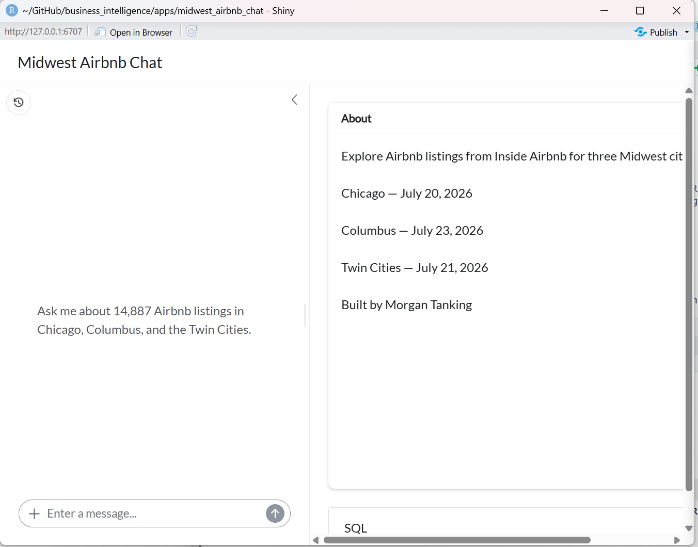

# ISA 401 Midwest Airbnb Chat

**Ask a question in plain English, get the SQL and a table back**

A querychat app built in ISA 401 at Miami University using 14,887 Airbnb listings from Chicago, Columbus, and the Twin Cities.

**Live app:** https://midwest-airbnb-chat-k4av.onrender.com

---

## What is this app?

The app connects to the Midwest Airbnb SQLite database and allows users to ask questions about Airbnb listings in plain English. Querychat translates the questions into SQL and returns results from the listings data.

**Example queries:**
- "How many listings are in each city?"
- "What is the average price of a listing in each city?"
- "Which neighborhoods have the highest average review ratings?"

## App Screenshot



---

## Dataset Information

**Dataset:** `listings` table in `data/midwest_airbnb.db` (14,887 rows, 29 columns)  
**Source:** Inside Airbnb  
**Cities and snapshot dates:** Chicago (July 20, 2026), Columbus (July 23, 2026), and Twin Cities (July 21, 2026)  
**Data dictionary:** `data/data_desc.md`  
**Query rules for the LLM:** `data/extra_instructions.md`

### Key Fields

| Field | Description |
|-------|-------------|
| `city` | City associated with the Airbnb listing |
| `neighbourhood` | Inside Airbnb neighborhood |
| `price` | Nightly listing price |
| `property_type` | Type of Airbnb property |
| `accommodates` | Number of guests the listing accommodates |
| `review_scores_rating` | Listing review rating |
| `estimated_revenue_l365d` | Estimated revenue over the last 365 days |
| `amenities_count` | Number of amenities for the listing |

---

## Required Secret

The app calls OpenAI (`gpt-5.6-luna` with reasoning off) through ellmer, so it requires an environment variable named `OPENAI_API_KEY`.

For local use, the API key is stored in `.Renviron`. For the deployed app, `OPENAI_API_KEY` is added as an environment variable in Render.

Never commit the API key. `.Renviron` is listed in `.gitignore` for that reason.
---

## Running Locally


with:

````markdown
**With R:**
```r
# from inside apps/midwest_airbnb_chat/
shiny::runApp()
```

**With Docker:**
```bash
docker build -t midwest_airbnb_chat .
docker run --rm -p 7860:7860 -e OPENAI_API_KEY=$OPENAI_API_KEY midwest_airbnb_chat
```

Then open http://localhost:7860.

---

## Technology Stack

- **[Shiny](https://shiny.posit.co/)** - Web application framework for R
- **[querychat](https://github.com/posit-dev/querychat)** - Natural language data querying
- **[ellmer](https://ellmer.tidyverse.org/)** - LLM client for R
- **[RSQLite](https://rsqlite.r-dbi.org/)** - SQLite driver for R

---

## Course Information

This application was developed for **ISA 401: Business Intelligence & Analytics** at **Miami University** as part of Assignment 05.